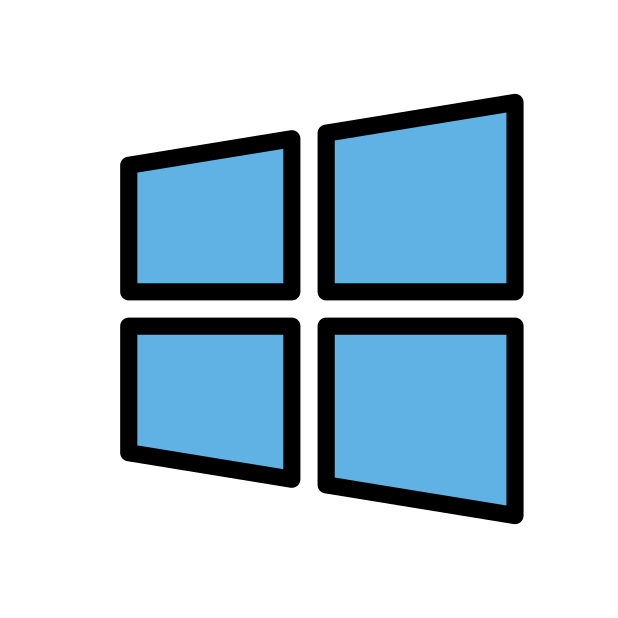
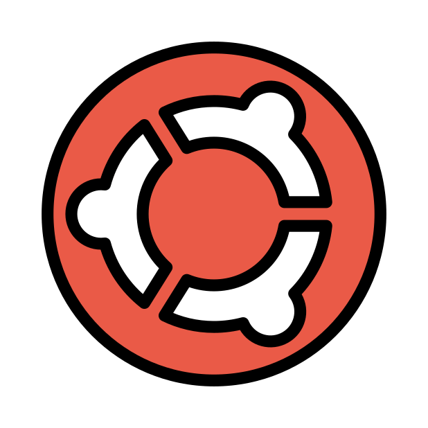

  

[Visit the MI/AIR 2025 Conference Website](https://sites.google.com/miair.org/miair2023/home)

### Overview
Supporting materials for the 3 part Local LLM series from the University of Michigan - Flint. Use the links below to access all materials and setup guides.

### Setup Instructions by Operating System
-  [Windows Setup Guide](setup/WINDOWS_SETUP.md)
-  [Mac Setup Guide](setup/MAC_SETUP.md)
-  [Linux Setup Guide](setup/LINUX_SETUP.md)

## 🔗 Useful Links 
- [Vocabulary & Acronyms](docs/vocabulary_and_acronyms.md)
- [MI/AIR 2025 Conference Website](https://sites.google.com/miair.org/miair2023/home)
- [Ollama Documentation](https://github.com/ollama/ollama/tree/main/docs)
- [LM Studio Documentation](https://lmstudio.ai/docs/app)

## 📚 Interactive Outlines

- [Part 1 DIY Local LLM Bootcamp 🤖](abstracts/part1_outline.md)
- [Part 2 Bridging Local LLMs to Apps 🔗](abstracts/part2_outline.md)
- [Part 3 Vibe Coding with Local LLMs ✨](abstracts/part3_outline.md)

## 📜 License 

This repository is for educational and informational purposes for MI/AIR 2025 participants.

---

🎉 Enjoy the conference and happy learning! 🎉
